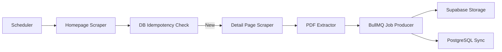

<div align="center">

# Eligify Automation: Sarkari Result Scraper

**The Intelligent Backbone of the Eligify Ecosystem**  
*A distributed, event-driven web scraping engine designed for 24/7 exam discovery and automated data extraction.*

[](https://nodejs.org/)
[](https://playwright.dev/)
[](https://redis.io/)
[](https://docs.bullmq.io/)
[](https://supabase.com/)

</div>

---

## Table of Contents

- [What is Eligify Automation?](#what-is-eligify-automation)
- [Architecture: The Automated Pipeline](#architecture-the-automated-pipeline)
  - [Core Components](#core-components)
- [Feature Deep-Dive](#feature-deep-dive)
  - [1. Intelligent PDF Extraction](#1-intelligent-pdf-extraction)
  - [2. Failure-Resilient Design](#2-failure-resilient-design)
  - [3. Idempotency & Normalization](#3-idempotency--normalization)
- [The Engineering Mindset](#the-engineering-mindset)
- [About the Developer](#about-the-developer)
- [Setup & Execution](#setup--execution)
  - [Prerequisites](#prerequisites)
  - [Installation](#installation)
  - [Running the Engine](#running-the-engine)
- [License](#license)

---

## What is Eligify Automation?

While the Eligify Dashboard handles the user experience, the **Automation Engine** is what keeps the data fresh. It is a high-reliability scraping service that monitors major government job portals to detect, parse, and ingest new exam opportunities the moment they are published.

This isn't just a simple script; it's a **distributed pipeline** designed with idempotency and fault tolerance at its core.

---

## 🏗️ Architecture: The Automated Pipeline

The engine follows a sophisticated linear flow to ensure no data is lost or duplicated:



### Core Components

1.  **Distributed Scheduler (`scheduler.js`)**: Uses `node-cron` to orchestrate recurring scraping cycles without manual intervention.
2.  **Playwright Scraping Engine**: A headless browser cluster that handles dynamic content, retries, and navigation across complex job portal layouts.
3.  **Idempotency Layer**: Every discovery is normalized and checked against a unique title-hash in PostgreSQL to prevent duplicate processing.
4.  **BullMQ & Redis**: Orchestrates heavy lifting (like PDF processing) into background jobs, allowing the scraper to stay lightweight and fast.
5.  **OCR Ready**: Includes Tesseract `traineddata` (English & Hindi) to support future extraction from image-based notifications.

---

## 🛠️ Feature Deep-Dive

### 1. Intelligent PDF Extraction
The engine doesn't just find links; it navigates through detail pages to find the official notification PDFs. It validates them using HTTP headers and file signature checks before pushing them to **Supabase Storage** for internal hosting.

### 2. Failure-Resilient Design
-   **Structured Logging**: Uses `pino` for high-performance JSON logging, making it easy to monitor health via external log aggregators.
-   **Retry Logic**: Automated retries for network-flaky detail pages.
-   **Scraper Logs Table**: Every failure or discovery event is logged to a dedicated `scraper_logs` table for post-mortem analysis.

### 3. Idempotency & Normalization
The system normalizes exam titles (removing whitespace, casing, and special characters) before hashing. This ensures that even if a portal re-titles a post slightly, Eligify recognizes it as a known entity.

---

## 🧠 The Engineering Mindset

> *"Automation is the elimination of cognitive load."*

The Eligify Automation engine was built with a **production-first** mentality. It solves the "Data Freshness" problem through architectural design:
-   **Queue-Based Decoupling**: Scraping (fast) is separated from PDF processing/uploading (slow) using BullMQ.
-   **Stateful Tracking**: The `discovered_exams` table acts as a state machine, tracking whether a job is `pending`, `queued`, or `completed`.
-   **Concurrency Management**: Designed to be horizontally scalable—multiple workers can process the same Redis queue to handle sudden surges in job postings.

---

## About the Developer

**Himanshu Kumar**  
B.Tech Computer Science & Engineering — BIT Mesra, Jaipur Campus (2023–2027) | GPA: 8.3/10

| Credential | Detail |
|---|---|
| 🎖️ **SSB Recommended** | My background in the Sainik School system and recommendation by the Service Selection Board (SSB) instills a sense of mission-critical reliability in my automation scripts. I build code that I can trust to run in the dark. |
| 💻 **Logic-First Development** | With 100+ LeetCode problems solved, I treat scraping challenges as complex graph traversal and pattern matching problems rather than simple DOM selection. |

**Stack**: Node.js · Playwright · BullMQ · Redis · Supabase · Tesseract OCR · PostgreSQL

📧 himanshu99071@gmail.com  
🔗 [github.com/himanshukumar1218](https://github.com/himanshukumar1218)

---

## 🚀 Setup & Execution

### Prerequisites
- Node.js 18+
- Redis (for BullMQ)
- Supabase Project (Postgres & Storage)

### Installation
```bash
# 1. Install dependencies
npm install

# 2. Install Playwright browsers
npx playwright install chromium

# 3. Setup Environment
cp .env.example .env
# Edit .env with your Redis and Supabase credentials
```

### Running the Engine
```bash
# Run a single scraping cycle
npm run run-once

# Start the scheduled service
npm start

# Run the background worker example
npm run worker
```

---

## 📄 License
MIT © Himanshu Kumar
